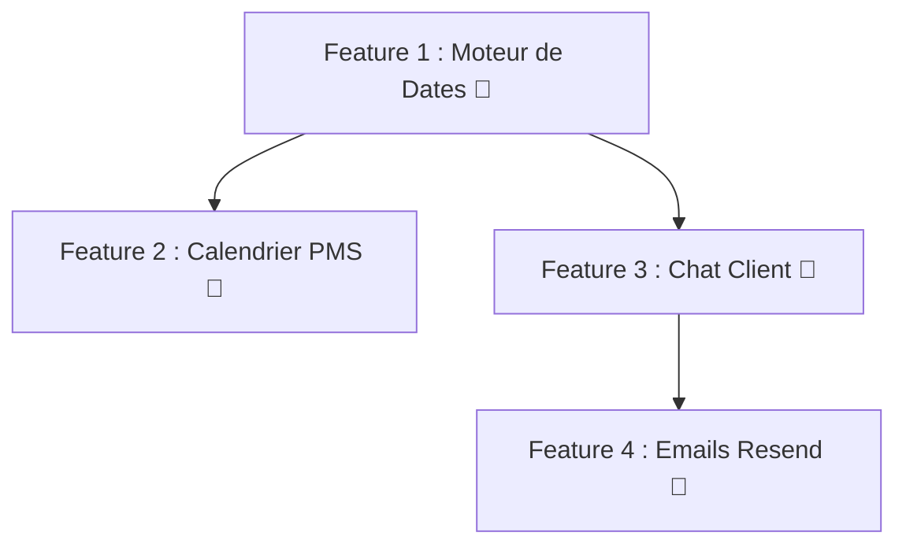

# 🚀 Plan d'Implémentation — HotelHub : Prochaines Grandes Fonctionnalités

> **Contexte :** L'application HotelHub est une plateforme multi-tenant (Client, Directeur, PDG) construite avec Next.js 14 (App Router), Zustand, et une couche de services simulée (mocks). Ce plan détaille les 4 fonctionnalités prioritaires à implémenter.

---

## Feature 1 — Moteur de Disponibilité par Dates

### Problème Actuel
Le filtre `showAvailableOnly` dans `hotelsfilterstore.ts` se contente de vérifier le champ `statut === "DISPONIBLE"` de la chambre. Ce statut est statique. Il ne tient **pas compte** des réservations existantes à des dates données.

### Approche Technique

**Étape A — Enrichir le modèle `Reservation`**

Le store `reservationStore.ts` et le service `bookingService` gèrent déjà des réservations avec des dates. Il faut s'assurer que chaque réservation stockée possède :
- `roomId` (lien vers la chambre)
- `checkIn: string` (ISO date)
- `checkOut: string` (ISO date)
- `status: "CONFIRMED" | "CANCELLED" | "COMPLETED"`

**Étape B — Créer une fonction de disponibilité**

Créer `utils/availability.ts` :
```typescript
// Retourne true si la chambre est libre pour les dates données
export function isRoomAvailable(
  roomId: string,
  checkIn: Date,
  checkOut: Date,
  allBookings: ClientReservation[]
): boolean {
  return !allBookings.some(
    (b) =>
      b.roomId === roomId &&
      b.status !== "CANCELLED" &&
      new Date(b.checkIn) < checkOut &&
      new Date(b.checkOut) > checkIn
  );
}
```

**Étape C — Ajouter les dates au store de filtres**

Dans `store/hotelsfilterstore.ts`, ajouter :
```typescript
checkIn: Date | null;
checkOut: Date | null;
setCheckIn: (date: Date | null) => void;
setCheckOut: (date: Date | null) => void;
```

**Étape D — Intégration dans l'UI (3 points)**

1. **Page d'accueil (Hero de `HeroSection.tsx`)** : Transformer le bloc d'action en un vrai formulaire de recherche avec Check-in / Check-out (le composant `DatePicker.tsx` existe déjà !) + un bouton "Rechercher". Ce formulaire remplit le store, et la navigation redirige vers `/hotels`.

2. **Page `/hotels` (`HotelsListPage.tsx`)** : Afficher les dates sélectionnées comme filtre actif. La logique `filteredHotels` appelle `isRoomAvailable()` pour chaque chambre.

3. **Page Détail de l'hôtel (`HotelDetailPage.tsx`)** : Afficher un sélecteur de dates en haut de la page. La liste des chambres se met à jour dynamiquement. Le composant `BookableRoomCard.tsx` reçoit les dates en prop pour les passer au formulaire de réservation.

### Fichiers à Créer / Modifier
| Action | Fichier |
|---|---|
| **[NEW]** | `utils/availability.ts` |
| **[MODIFY]** | `store/hotelsfilterstore.ts` |
| **[MODIFY]** | `src/components/HeroSection.tsx` |
| **[MODIFY]** | `src/components/HotelsListPage.tsx` |
| **[MODIFY]** | `src/components/HotelDetailPage.tsx` |
| **[MODIFY]** | `src/components/BookableRoomCard.tsx` |

---

## Feature 2 — Calendrier de Gestion PMS pour le Directeur (Diagramme de Gantt)

### Problème Actuel
Le Directeur n'a qu'une vue tabulaire de ses réservations. Il ne peut pas visualiser l'occupation sur l'ensemble du mois d'un seul regard.

### Approche Technique

**Étape A — Créer le composant `GanttCalendar.tsx`**

Ce composant reçoit en props :
- `rooms: Chambre[]`
- `bookings: ClientReservation[]`
- `currentMonth: Date`

Structure HTML/CSS :
- **Colonne de gauche** : liste des noms de chambres (ex: "Suite Royale 101")
- **Colonnes de droite** : les jours du mois (1 à 31)
- **Blocs colorés** : pour chaque réservation, un bloc coloré positionné en CSS Grid ou `position: absolute` avec `left` et `width` calculés en pourcentage du mois

```
| Chambre          | 1 | 2 | 3 | 4 | ... | 30 | 31 |
|------------------|---|---|---|---|-----|----|----|
| Suite Royale 101 | [====== Martin J. ======] |    |
| Chambre Standard | ░ | ░ | [==== Doe A. ====]      |
```

**Étape B — Logique de rendu des blocs**

Pour chaque `booking`, calculer :
```typescript
const startDay = getDate(parseISO(booking.checkIn));
const endDay = getDate(parseISO(booking.checkOut));
const daysInMonth = getDaysInMonth(currentMonth);
const leftPct = ((startDay - 1) / daysInMonth) * 100;
const widthPct = ((endDay - startDay) / daysInMonth) * 100;
```

**Étape C — Navigation et interactions**
- Boutons `← Mois précédent` / `Mois suivant →`
- Au clic sur un bloc de réservation, afficher un mini-modal avec les détails (nom client, dates, statut)
- Au clic sur une cellule vide, ouvrir le modal de création de réservation avec les dates pré-remplies

**Étape D — Intégration dans le Dashboard Directeur**

Créer un nouvel onglet **"Calendrier"** dans `DirectorDashboard.tsx`, avec l'icône `CalendarRange` (Lucide), entre "Statistiques" et "Avis".

### Fichiers à Créer / Modifier
| Action | Fichier |
|---|---|
| **[NEW]** | `src/components/director/tabs/GanttCalendarTab.tsx` |
| **[MODIFY]** | `src/components/DirectorDashboard.tsx` |
| **[MODIFY]** | `messages/fr.json` + `messages/en.json` |

---

## Feature 3 — Chat Client ↔ Hôtel

### Problème Actuel
La messagerie existe uniquement entre PDG et Directeurs. Les clients n'ont aucun moyen de contacter un hôtel.

### Approche Technique

**Étape A — Étendre le `messagesStore.ts`**

Le store actuel gère déjà des messages avec `senderId` et `receiverId`. Il suffit d'utiliser l'`id` du client et l'`id` du directeur de l'hôtel concerné comme participants.

**Étape B — Ajouter une section "Messagerie" dans `ClientDashboard.tsx`**

Un nouvel onglet "Messages" dans le tableau de bord client avec :
- Liste des conversations (une par hôtel avec lequel le client a interagi)
- L'interface de chat réutilise le composant **`MessagesTab.tsx`** déjà créé
- Les contacts du client = les directeurs des hôtels où il a une réservation

```typescript
// Dans ClientDashboard.tsx
const myHotels = bookings.map(b => b.hotelId);
const myDirectors = directors.filter(d => myHotels.includes(d.hotelId));
const contacts = myDirectors.map(d => ({
  id: d.id,
  name: d.nom,
  role: "Hôtel",
  avatarInitial: d.nom.charAt(0)
}));
```

**Étape C — Bouton "Contacter l'hôtel" sur `HotelDetailPage.tsx`**

Un bouton flottant dans le panneau de droite (côté desktop). Au clic :
- Si connecté : ouvre un modal avec l'interface de chat `MessagesTab.tsx`
- Si non connecté : redirige vers `/login` avec un paramètre `redirect`

**Étape D — Notification au Directeur**

Le compteur de messages non lus (`unreadMessagesCount`) dans `DirectorDashboard.tsx` inclut déjà les messages de tous les utilisateurs. Les messages clients seront donc automatiquement pris en compte.

### Fichiers à Créer / Modifier
| Action | Fichier |
|---|---|
| **[MODIFY]** | `src/components/ClientDashboard.tsx` |
| **[MODIFY]** | `src/components/HotelDetailPage.tsx` |
| **[NEW]** | `src/components/client/ChatModal.tsx` |
| **[MODIFY]** | `messages/fr.json` + `messages/en.json` |

---

## Feature 4 — Notifications Email (via Resend)

### Problème Actuel
Il n'existe que des notifications in-app (la cloche). Aucun email n'est envoyé pour confirmer une réservation, rappeler un check-in, ou demander un avis post-séjour.

### Approche Technique

> **Service recommandé : [Resend](https://resend.com)** — Gratuit jusqu'à 3 000 emails/mois, excellente intégration Next.js, compatible avec les React Server Components pour les templates HTML.

**Étape A — Installer Resend**
```bash
npm install resend
```

**Étape B — Créer les templates d'emails (composants React)**

```
src/emails/
├── BookingConfirmation.tsx   (✅ Réservation confirmée)
├── CheckinReminder.tsx       (⏰ Rappel J-1 avant le check-in)
├── CheckoutReview.tsx        (⭐ Demande d'avis post-séjour)
└── BookingCancelled.tsx      (❌ Annulation confirmée)
```

Les templates utilisent la lib `@react-email/components` pour des emails au design premium.

**Étape C — Créer les API Routes Next.js**

```
src/app/api/emails/
├── booking-confirmation/route.ts
├── checkin-reminder/route.ts
└── checkout-review/route.ts
```

Chaque route `POST` reçoit les données de réservation, instancie Resend et envoie le bon email :
```typescript
// src/app/api/emails/booking-confirmation/route.ts
import { Resend } from "resend";
import BookingConfirmationEmail from "@/src/emails/BookingConfirmation";

const resend = new Resend(process.env.RESEND_API_KEY);

export async function POST(req: Request) {
  const { booking, clientName, clientEmail } = await req.json();
  await resend.emails.send({
    from: "HotelHub <noreply@hotelhub.com>",
    to: clientEmail,
    subject: `✅ Confirmation de votre réservation — ${booking.hotelName}`,
    react: BookingConfirmationEmail({ booking, clientName }),
  });
  return Response.json({ success: true });
}
```

**Étape D — Déclencher les emails depuis le store**

Dans `reservationStore.ts`, après un `createBooking` réussi :
```typescript
// Appel non-bloquant (fire & forget)
fetch("/api/emails/booking-confirmation", {
  method: "POST",
  body: JSON.stringify({ booking, clientName: user.nom, clientEmail: user.email }),
});
```

**Étape E — Configuration**

Ajouter au fichier `.env.local` :
```
RESEND_API_KEY=re_xxxxxxxxxxxxxx
```

### Fichiers à Créer / Modifier
| Action | Fichier |
|---|---|
| **[NEW]** | `src/emails/BookingConfirmation.tsx` |
| **[NEW]** | `src/emails/CheckinReminder.tsx` |
| **[NEW]** | `src/emails/CheckoutReview.tsx` |
| **[NEW]** | `src/app/api/emails/booking-confirmation/route.ts` |
| **[NEW]** | `src/app/api/emails/checkin-reminder/route.ts` |
| **[MODIFY]** | `store/reservationStore.ts` |
| **[MODIFY]** | `.env.local` |

---

## Ordre d'Implémentation Recommandé



1. **Feature 1 en premier** — C'est le cœur du métier. Elle débloque logiquement les Features 2 et 3.
2. **Features 2 & 3 en parallèle** — Elles sont indépendantes entre elles.
3. **Feature 4 en dernier** — Elle nécessite un compte Resend et une clé API, et vient couronner l'ensemble en envoyant des emails sur la base des réservations créées par la Feature 1.
